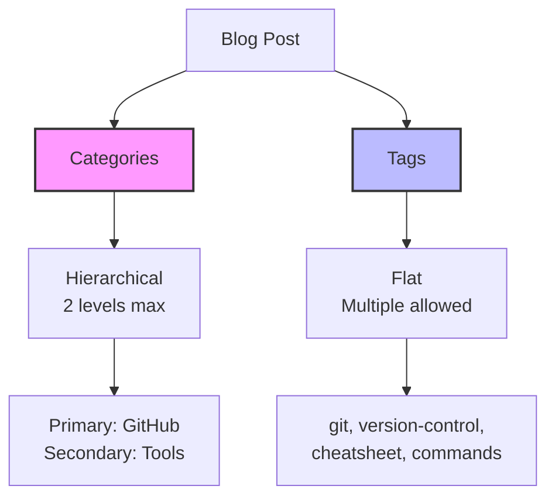

## Why Organization Matters

When I started blogging, I just threw posts up without thinking about structure. Big mistake! As your blog grows, finding content becomes a nightmare - both for you and your readers.

Today I reorganized all my GitHub-related posts under a single **GitHub** category, and the difference is remarkable. Let me show you how categories and tags work in Chirpy and why they're essential for a professional blog.

---

## Categories vs. Tags: What's the Difference?



### Categories

- **Hierarchical** - Maximum 2 levels (Parent/Child)
- **Broad groupings** - Think of them as folders
- **Limited** - Each post has exactly one category pair
- **URL structure** - Creates `/categories/github/`

**Example:**
```yaml
categories: [GitHub, Tools]
#             ↑        ↑
#          Primary  Secondary
```

### Tags

- **Flat structure** - No hierarchy
- **Descriptive keywords** - What the post is about
- **Multiple allowed** - As many as relevant (but don't go crazy)
- **Discoverable** - Helps readers find related content

**Example:**
```yaml
tags: [git, version-control, cheatsheet, github, commands]
```

---

## Front Matter Basics

Every Chirpy post starts with **front matter** - YAML between triple dashes:

```yaml
---
title: "Your Post Title"
date: 2025-11-17 12:00:00 +0000
categories: [Primary, Secondary]
tags: [tag1, tag2, tag3]
pin: false
math: false
mermaid: false
---
```

### Key Fields Explained

| Field | Purpose | Example |
|-------|---------|---------|
| `title` | Post title (in quotes) | `"My Awesome Post"` |
| `date` | Publication date/time | `2025-11-17 01:00:00 +0000` |
| `categories` | 2-level hierarchy | `[GitHub, Tools]` |
| `tags` | Keywords (lowercase) | `[git, tutorial, beginner]` |
| `pin` | Stick to top of homepage | `true` or `false` |
| `math` | Enable math equations | `true` or `false` |
| `mermaid` | Enable diagrams | `true` or `false` |

> **Important Time Tip:** Always use `01:00:00 +0000` as your default time! Jekyll skips posts with future timestamps, so using 1:00 AM ensures your post is ALWAYS in the past and will display immediately.
{: .prompt-warning }

---

## Organizing with Categories

### My Category Strategy

I organize by **primary topic** and **content type**:

| Primary | Secondary | Use For |
|---------|-----------|---------|
| `GitHub` | `Tools` | Git cheatsheets, utilities |
| `GitHub` | `Guides` | Step-by-step tutorials |
| `GitHub` | `Troubleshooting` | Error fixes, common mistakes |
| `GitHub` | `Deployment` | Hosting, CI/CD |
| `Security` | `Tools` | Python scripts, automation |
| `Blogging` | `Chirpy` | Blog setup, customization |
| `HackTheBox` | `Easy/Medium/Hard` | CTF writeups |

### Real Example: Reorganizing GitHub Posts

I had these posts scattered across categories:

**Before:**
```yaml
# Post 1
categories: [Development, Tools]

# Post 2
categories: [Development, Tools]

# Post 3
categories: [Blogging, Chirpy]
```

**After:**
```yaml
# Post 1: Git Commands Cheatsheet
categories: [GitHub, Tools]

# Post 2: Git Authentication Errors
categories: [GitHub, Troubleshooting]

# Post 3: GitHub Pages Deployment
categories: [GitHub, Deployment]

# Post 4: GitHub Releases Guide
categories: [GitHub, Guides]
```

Now all GitHub content lives under `/categories/github/` - one click to see everything!

---

## Tagging Best Practices

### Do's ✅

1. **Use lowercase** - `git` not `Git`
2. **Be specific** - `python3` not just `programming`
3. **Be consistent** - Pick one: `github-pages` or `github_pages` (stick with it)
4. **Use common terms** - What would people search for?
5. **Limit to 5-8 tags** - Focused, not exhaustive

### Don'ts ❌

1. **Don't duplicate category** - If category is `GitHub`, don't add tag `github-category`
2. **Don't over-tag** - 20 tags = noise, not signal
3. **Don't be too broad** - `code` is useless, `python-automation` is helpful
4. **Don't use spaces** - `version-control` not `version control`

### Tag Examples by Post Type

**Git Tutorial:**
```yaml
tags: [git, version-control, cheatsheet, commands, beginner]
```

**Python Tool:**
```yaml
tags: [python, automation, tkinter, pygame, cross-platform]
```

**Error Fix:**
```yaml
tags: [git, github, authentication, troubleshooting, errors, ssh]
```

**HTB Writeup:**
```yaml
tags: [htb, linux, privesc, web, enumeration, nmap]
```

---

## How Chirpy Uses Categories & Tags

### Auto-Generated Pages

Chirpy automatically creates:

- **`/categories/`** - Lists all categories
- **`/categories/github/`** - All posts in GitHub category
- **`/tags/`** - Lists all tags
- **`/tags/git/`** - All posts tagged with `git`

No configuration needed - just use consistent naming!

### Navigation

Your sidebar shows:
- Categories (hierarchical tree)
- Tags (cloud or list)
- Archives (by date)

### SEO Benefits

- Clean URLs: `/categories/github/guides/`
- Better indexing by search engines
- Users find related content easily

---

## Practical Example: Creating a New Category

Let's say you want to create a **GitHub** category for all git-related content.

### Step 1: Update Post Front Matter

```yaml
---
title: "Git Commands Cheatsheet"
date: 2025-11-17 05:00:00 +0000
categories: [GitHub, Tools]  # ← New category!
tags: [git, commands, cheatsheet]
---
```

### Step 2: That's It!

Seriously. Chirpy auto-generates the category page when you build. No additional files needed.

### Step 3: Verify

```bash
bundle exec jekyll serve
# Visit: http://127.0.0.1:4000/categories/
# Click on "GitHub" - see all your posts!
```

---

## My Current Blog Structure

Here's how I've organized my growing blog:

```
Categories:
├── GitHub/
│   ├── Tools (cheatsheets, utilities)
│   ├── Guides (tutorials, how-tos)
│   ├── Troubleshooting (errors, fixes)
│   └── Deployment (CI/CD, hosting)
├── Security/
│   └── Tools (Python scripts, automation)
├── Blogging/
│   └── Chirpy (setup, customization)
└── HackTheBox/
    ├── Easy
    ├── Medium
    └── Hard
```

Each category groups related content, making navigation intuitive.

---

## Tips for Beginners

### 1. Start Simple

Don't overthink it. Begin with:
- 3-4 main categories
- 5-6 tags per post
- Expand as needed

### 2. Be Consistent

Once you pick a naming scheme, stick with it:
- `GitHub` not sometimes `Git` or `Version-Control`
- `python` not sometimes `Python` or `py`

### 3. Think Like Your Reader

What would they search for? What makes sense to group together?

### 4. Review Periodically

As your blog grows, you might need to:
- Split large categories
- Merge small ones
- Rename for clarity

I just did this with my GitHub posts - better late than never!

---

## Common Mistakes to Avoid

### 1. Too Many Categories

❌ **Bad:**
```yaml
categories: [Programming, Development, Coding, Software, Tech]
```

✅ **Good:**
```yaml
categories: [Development, Tools]
```

### 2. Inconsistent Capitalization

❌ **Bad:**
```yaml
# Post 1
tags: [Git, GitHub, version-control]

# Post 2
tags: [git, github, Version-Control]
```

✅ **Good:**
```yaml
# Both posts
tags: [git, github, version-control]
```

### 3. Forgetting the Array Syntax

❌ **Bad:**
```yaml
categories: GitHub, Tools
tags: git, commands
```

✅ **Good:**
```yaml
categories: [GitHub, Tools]
tags: [git, commands]
```

---

## Quick Reference

### Front Matter Template

```yaml
---
title: "Your Post Title Here"
date: 2025-11-17 01:00:00 +0000  # Always use 01:00:00 - safe default!
categories: [Primary, Secondary]
tags: [tag1, tag2, tag3, lowercase, hyphenated]
pin: false
math: false
mermaid: false
---
```

> **Remember:** Use `01:00:00 +0000` to avoid future-date issues!
{: .prompt-tip }

### Category Naming

- Use **Title Case**: `GitHub`, `Security`, `HackTheBox`
- Maximum **2 levels**: `[Primary, Secondary]`
- Be **broad but meaningful**

### Tag Naming

- Use **lowercase**: `git`, `python`, `linux`
- Use **hyphens**: `version-control`, `github-pages`
- Be **specific and searchable**

---

## Conclusion

Organizing your blog with categories and tags isn't just about looking professional - it's about **respecting your readers' time**. When someone lands on your blog, they should be able to find related content instantly.

Today I learned this firsthand by grouping all my GitHub posts under one category. Now readers interested in version control can find everything in one place.

**Key takeaways:**
1. Categories = Broad folders (2 levels max)
2. Tags = Specific keywords (5-8 per post)
3. Be consistent with naming
4. Chirpy auto-generates navigation pages
5. Review and reorganize as your blog grows

Your future self (and your readers) will thank you!

---

## Further Reading: GitHub Category Posts

Now that all my GitHub content is organized, check out these posts:

- **[Git Commands: The Ultimate Cheatsheet](/posts/git-commands-ultimate-cheatsheet/)** - Master essential git commands with practical examples and visual diagrams

- **[Git Authentication: Common Mistakes](/posts/git-authentication-common-mistakes/)** - Learn from real errors and how to fix them

- **[GitHub Releases and Tags: Complete Guide](/posts/github-releases-and-tags-complete-guide/)** - Understand version management and how to create proper releases

- **[Deploying Chirpy to GitHub Pages](/posts/deploying-chirpy-to-github-pages/)** - Set up free hosting with automatic builds for your Jekyll blog

All of these posts now live under the **GitHub** category, demonstrating the power of good organization!

---

## External Resources

- [Jekyll Front Matter Documentation](https://jekyllrb.com/docs/front-matter/)
- [Chirpy Theme Wiki](https://github.com/cotes2020/jekyll-theme-chirpy/wiki)
- [YAML Syntax Guide](https://yaml.org/spec/1.2.2/)
