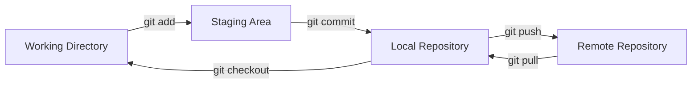

## Why Git?

Git is the backbone of modern software development. Whether you're pushing HTB writeups, collaborating on tools, or managing your dotfiles - Git tracks everything.

> "Git is like a time machine for your code - except you can't accidentally kill your grandfather."

## The Big Picture



---

## 🔥 Top 10 Essential Git Commands

### 1. `git status` - The Health Check

**What it does:** Shows the state of your working directory and staging area.

```bash
git status
```

**Output breakdown:**
```
On branch main
Your branch is up to date with 'origin/main'.

Changes to be committed:
  (use "git restore --staged <file>..." to unstage)
        modified:   README.md          # ✅ Staged

Changes not staged for commit:
        modified:   script.py          # 📝 Modified but not staged

Untracked files:
        new_file.txt                   # ❓ Git doesn't know about this
```

**Pro tip:** Use `git status -s` for short format:
```bash
git status -s
# M  README.md     (staged)
#  M script.py     (modified)
# ?? new_file.txt  (untracked)
```

---

### 2. `git add` - Stage Your Changes

**What it does:** Tells Git which changes to include in the next commit.

```bash
# Add specific file
git add filename.py

# Add all changes in current directory
git add .

# Add all changes everywhere
git add -A

# Interactive staging (choose hunks)
git add -p
```

**Visual:**
```
Working Directory  →  Staging Area  →  Repository
     [changes]    git add    [ready]    git commit
```

**Pro tip:** Stage only parts of a file:
```bash
git add -p script.py
# Shows each change, you choose: y/n/s/e/q
```

---

### 3. `git commit` - Save Your Work

**What it does:** Creates a snapshot of your staged changes with a message.

```bash
# Standard commit
git commit -m "Add user authentication feature"

# Commit with detailed message (opens editor)
git commit

# Stage all tracked files AND commit
git commit -am "Fix login bug"

# Amend last commit (careful with pushed commits!)
git commit --amend
```

**Good commit messages:**
```bash
# ✅ Good - describes what and why
git commit -m "Fix SQL injection vulnerability in login form"

# ❌ Bad - vague and useless
git commit -m "Fixed stuff"
git commit -m "Updates"
git commit -m "asdfgh"
```

**Commit message template:**
```
<type>: <subject>

<body - optional>

<footer - optional>
```

**Types:** `feat`, `fix`, `docs`, `style`, `refactor`, `test`, `chore`

---

### 4. `git push` - Share Your Code

**What it does:** Uploads local commits to remote repository.

```bash
# Push to default remote
git push

# Push and set upstream (first time)
git push -u origin main

# Push specific branch
git push origin feature-branch

# Force push (DANGEROUS - rewrites history)
git push --force
# Safer alternative:
git push --force-with-lease
```

**Common scenarios:**
```bash
# Push new branch
git push -u origin new-feature

# Push tags
git push --tags

# Push all branches
git push --all origin
```

**⚠️ Warning:** Never force push to shared branches (main/master) unless you absolutely know what you're doing!

---

### 5. `git pull` - Get Latest Changes

**What it does:** Fetches and merges changes from remote repository.

```bash
# Pull from default remote
git pull

# Pull specific branch
git pull origin main

# Pull with rebase (cleaner history)
git pull --rebase

# Pull without auto-merge
git fetch
git merge origin/main
```

**Pull vs Fetch:**
```bash
git pull  = git fetch + git merge
```

**Pro tip:** Always pull before pushing to avoid conflicts:
```bash
git pull --rebase && git push
```

---

### 6. `git log` - View History

**What it does:** Shows commit history with details.

```bash
# Full log
git log

# Compact one-line format
git log --oneline

# With graph visualization
git log --oneline --graph --all

# Last 5 commits
git log -5

# Commits by author
git log --author="Ranger"

# Search commit messages
git log --grep="bug fix"

# Show changes in each commit
git log -p

# Stats (files changed, insertions, deletions)
git log --stat
```

**Beautiful log format:**
```bash
git log --oneline --graph --decorate --all
```

**Output:**
```
* 3a2b1c0 (HEAD -> main) Add authentication
| * f4e5d6c (feature) Work in progress
|/
* 9c8d7e6 (origin/main) Initial commit
```

**Pro tip:** Create an alias for pretty log:
```bash
alias gitlog='git log --oneline --graph --decorate --all'
```

---

### 7. `git branch` - Manage Branches

**What it does:** List, create, or delete branches.

```bash
# List local branches
git branch

# List all branches (including remote)
git branch -a

# Create new branch
git branch feature-login

# Delete branch (safe - won't delete unmerged)
git branch -d old-branch

# Force delete branch
git branch -D experimental

# Rename current branch
git branch -m new-name

# Show last commit on each branch
git branch -v
```

**Branch naming conventions:**
```
feature/user-authentication
bugfix/login-error
hotfix/security-patch
release/v2.0.0
```

---

### 8. `git checkout` / `git switch` - Navigate

**What it does:** Switch branches or restore files.

```bash
# Switch to existing branch
git checkout main
# Modern alternative:
git switch main

# Create and switch to new branch
git checkout -b new-feature
# Modern alternative:
git switch -c new-feature

# Restore file to last commit
git checkout -- filename.py
# Modern alternative:
git restore filename.py

# Checkout specific commit (detached HEAD)
git checkout abc123

# Checkout file from another branch
git checkout other-branch -- file.txt
```

**Modern Git (2.23+):**
```bash
git switch    # For switching branches
git restore   # For restoring files
```

**Detached HEAD warning:**
```
You are in 'detached HEAD' state...
```
This means you're not on a branch. Create one to save work:
```bash
git switch -c new-branch-name
```

---

### 9. `git diff` - See Changes

**What it does:** Shows differences between commits, branches, or working tree.

```bash
# Unstaged changes (working vs staged)
git diff

# Staged changes (staged vs last commit)
git diff --staged
# or
git diff --cached

# All changes (working vs last commit)
git diff HEAD

# Between two commits
git diff abc123 def456

# Between branches
git diff main..feature

# Specific file
git diff script.py

# Show only filenames
git diff --name-only

# Word-level diff (great for prose)
git diff --word-diff
```

**Color-coded output:**
```diff
- This line was removed (red)
+ This line was added (green)
```

**Pro tip:** Use external diff tool:
```bash
git difftool
```

---

### 10. `git clone` - Copy Repository

**What it does:** Creates a local copy of a remote repository.

```bash
# Clone via HTTPS
git clone https://github.com/user/repo.git

# Clone via SSH (recommended)
git clone git@github.com:user/repo.git

# Clone to specific directory
git clone https://github.com/user/repo.git my-folder

# Clone specific branch
git clone -b develop https://github.com/user/repo.git

# Shallow clone (latest commit only - faster)
git clone --depth 1 https://github.com/user/repo.git

# Clone with submodules
git clone --recurse-submodules https://github.com/user/repo.git
```

**After cloning:**
```bash
cd repo
git remote -v  # See remote URLs
git branch -a  # See all branches
```

---

## 🎯 Bonus Commands

### `git stash` - Temporary Storage

Save work without committing:
```bash
# Stash changes
git stash

# Stash with message
git stash save "WIP: fixing login"

# List stashes
git stash list

# Apply latest stash (keep in stash)
git stash apply

# Apply and remove from stash
git stash pop

# Apply specific stash
git stash apply stash@{2}

# Delete all stashes
git stash clear
```

### `git reset` - Undo Changes

```bash
# Unstage file (keep changes)
git reset HEAD file.txt

# Soft reset (keep changes staged)
git reset --soft HEAD~1

# Mixed reset (keep changes unstaged) - DEFAULT
git reset HEAD~1

# Hard reset (DESTROY changes) ⚠️
git reset --hard HEAD~1

# Reset to specific commit
git reset --hard abc123
```

**Reset modes:**
```
--soft   = Move HEAD, keep staging and working directory
--mixed  = Move HEAD, reset staging, keep working directory (default)
--hard   = Move HEAD, reset staging AND working directory (DANGER!)
```

### `git merge` - Combine Branches

```bash
# Merge feature into current branch
git merge feature-branch

# Merge with commit message
git merge feature-branch -m "Merge feature into main"

# Abort merge (if conflicts)
git merge --abort

# No fast-forward (creates merge commit)
git merge --no-ff feature-branch
```

### `git rebase` - Rewrite History

```bash
# Rebase current branch onto main
git rebase main

# Interactive rebase (edit, squash, reorder)
git rebase -i HEAD~3

# Continue after resolving conflicts
git rebase --continue

# Abort rebase
git rebase --abort
```

**⚠️ Golden Rule:** Never rebase public/shared branches!

---

## 🚨 Emergency Commands

### Undo Last Commit (Not Pushed)
```bash
# Keep changes
git reset --soft HEAD~1

# Discard changes
git reset --hard HEAD~1
```

### Recover Deleted Branch
```bash
git reflog
git checkout -b recovered-branch abc123
```

### Fix "Detached HEAD"
```bash
git switch -c save-my-work
```

### Remove File from Git (Keep Locally)
```bash
git rm --cached sensitive-file.txt
echo "sensitive-file.txt" >> .gitignore
git commit -m "Remove sensitive file from tracking"
```

### Discard All Local Changes
```bash
git checkout -- .
# or
git restore .
```

---

## 🎨 Git Configuration

### Set Identity
```bash
git config --global user.name "Ranger"
git config --global user.email "ranger@example.com"
```

### Useful Aliases
```bash
git config --global alias.st status
git config --global alias.co checkout
git config --global alias.br branch
git config --global alias.cm commit
git config --global alias.lg "log --oneline --graph --all"
```

### Default Branch Name
```bash
git config --global init.defaultBranch main
```

### Editor
```bash
git config --global core.editor vim
# or
git config --global core.editor "code --wait"
```

---

## 📊 Git Workflow Examples

### Feature Branch Workflow
```bash
# 1. Update main
git checkout main
git pull

# 2. Create feature branch
git checkout -b feature/user-auth

# 3. Make changes and commit
git add .
git commit -m "Add user authentication"

# 4. Push feature branch
git push -u origin feature/user-auth

# 5. Create Pull Request on GitHub

# 6. After merge, cleanup
git checkout main
git pull
git branch -d feature/user-auth
```

### Quick Fix Workflow
```bash
git stash                    # Save current work
git checkout main            # Switch to main
git pull                     # Get latest
git checkout -b hotfix       # Create hotfix branch
# Make fix...
git commit -am "Fix critical bug"
git push -u origin hotfix
# Create PR, merge
git checkout main
git pull
git branch -d hotfix
git stash pop                # Restore previous work
```

---

## 🔧 .gitignore Examples

```gitignore
# Python
__pycache__/
*.pyc
venv/
.env

# Node.js
node_modules/
npm-debug.log

# IDE
.vscode/
.idea/
*.swp

# OS
.DS_Store
Thumbs.db

# Secrets
*.key
*.pem
credentials.json
```

---

## Quick Reference Card

| Action | Command |
|--------|---------|
| Check status | `git status` |
| Stage file | `git add file` |
| Stage all | `git add .` |
| Commit | `git commit -m "msg"` |
| Push | `git push` |
| Pull | `git pull` |
| New branch | `git checkout -b name` |
| Switch branch | `git checkout name` |
| View log | `git log --oneline` |
| See changes | `git diff` |
| Clone repo | `git clone url` |
| Stash work | `git stash` |
| Undo staged | `git reset HEAD file` |
| Discard changes | `git restore file` |

---

## Resources

- [Pro Git Book (Free)](https://git-scm.com/book/en/v2)
- [Git Documentation](https://git-scm.com/docs)
- [GitHub Git Cheatsheet](https://education.github.com/git-cheat-sheet-education.pdf)
- [Oh Shit, Git!?!](https://ohshitgit.com/)
- [Learn Git Branching (Interactive)](https://learngitbranching.js.org/)

---

*Git is powerful but simple once you understand the fundamentals. Master these 10 commands and you'll handle 95% of your daily version control needs. The rest you can look up when needed!*

**Remember:** Commit early, commit often, and write meaningful messages. Your future self will thank you. 🚀

