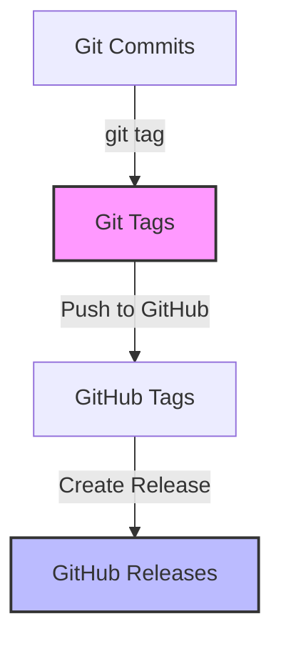

## The Problem: "Where's My New Release?"

You've just pushed a bunch of updates to your GitHub repository. You've incremented your version number in the code, updated your CHANGELOG, pushed everything... but when you go to GitHub's Releases page, you only see your old release. **Where's the new one?**

**The answer:** Pushing code doesn't create a release. You need to **create a Git tag first**.

This guide will show you exactly how releases work and how to create them properly.

---

## Understanding Git Tags vs. Releases

### What's the Difference?



| Concept | What It Is | Where It Lives |
|---------|-----------|----------------|
| **Git Commit** | A snapshot of your code | Local & Remote |
| **Git Tag** | A named pointer to a specific commit | Local & Remote |
| **GitHub Release** | A tag + release notes + downloadable assets | GitHub only |

**Key insight:** A **tag** is like a bookmark. A **release** is that bookmark with a description and downloadable package.

---

## Why You Can't Find Your Release

If you've:
- ✅ Updated your code
- ✅ Changed version numbers
- ✅ Pushed to GitHub
- ❌ **But NOT created a tag**

...then GitHub has no way of knowing you want to create a release.

GitHub Releases are built on top of Git tags. No tag = No release.

---

## Creating Your First Release

### Method 1: Command Line (Recommended)

#### Step 1: Create an Annotated Tag

```bash
# Create an annotated tag with a message
git tag -a v3.1.0 -m "Release v3.1.0 - CLI arguments and error handling"
```

**Why annotated (`-a`)?**
- Stores tagger name, email, date
- Includes a message
- Shows in `git show` with full details
- Professional and informative

#### Step 2: Push the Tag to GitHub

```bash
# Push a specific tag
git push origin v3.1.0

# Or push ALL tags at once
git push --tags
```

#### Step 3: Check GitHub

1. Go to your repository on GitHub
2. Click **"Releases"** (right sidebar or top menu)
3. You'll see your tag listed!

#### Step 4: Create the Release (Optional but Recommended)

Click on the tag, then click **"Create release from tag"** to add:
- Release title
- Description/release notes
- Binary downloads
- Mark as pre-release or latest

---

### Method 2: GitHub Web Interface

1. Go to your repository
2. Click **"Releases"** → **"Draft a new release"**
3. Click **"Choose a tag"**
4. Type your version (e.g., `v3.1.0`)
5. Click **"Create new tag: v3.1.0 on publish"**
6. Fill in:
   - **Release title**: `v3.1.0 - CLI Arguments & Error Handling`
   - **Description**: Your changelog notes
7. Click **"Publish release"**

This creates both the tag AND the release in one step!

---

## Tag Naming Conventions

### Semantic Versioning (SemVer)

The industry standard: `MAJOR.MINOR.PATCH`

```
v3.1.0
│ │ │
│ │ └─ PATCH: Bug fixes (backward compatible)
│ └─── MINOR: New features (backward compatible)
└───── MAJOR: Breaking changes
```

**Examples:**
- `v1.0.0` → First stable release
- `v1.1.0` → Added new feature
- `v1.1.1` → Fixed a bug
- `v2.0.0` → Major overhaul, breaking changes

### Common Prefix Styles

```bash
# With 'v' prefix (most common)
v1.0.0
v2.3.1

# Without prefix
1.0.0
2.3.1

# With codenames
v3.0.0-alpha
v3.0.0-beta
v3.0.0-rc1  # Release Candidate
```

---

## Essential Tag Commands

### View All Tags

```bash
# List all tags
git tag

# List with pattern
git tag -l "v3.*"

# Show tag details
git show v3.1.0
```

### Creating Tags

```bash
# Lightweight tag (not recommended for releases)
git tag v1.0.0

# Annotated tag (recommended)
git tag -a v1.0.0 -m "Initial release"

# Tag a specific commit (retroactive tagging)
git tag -a v1.0.0 abc123 -m "Tagging old commit"
```

### Pushing Tags

```bash
# Push single tag
git push origin v3.1.0

# Push all tags
git push --tags

# Push all tags with branch
git push origin main --tags
```

### Deleting Tags (Be Careful!)

```bash
# Delete local tag
git tag -d v1.0.0

# Delete remote tag
git push origin --delete v1.0.0
```

---

## Best Practices

### 1. Tag After Final Testing

```bash
# Don't tag until you're sure it's ready
git push origin main
# Test everything...
git tag -a v3.1.0 -m "Release v3.1.0"
git push origin v3.1.0
```

### 2. Use CHANGELOG.md

Keep a changelog file that documents all changes. When creating a release, copy the relevant section:

```markdown
## [3.1.0] - 2025-11-17

### Added
- CLI argument support (--gif, --audio, --volume)
- Graceful error handling
- Silent mode with --no-sound

### Changed
- Version bumped to 3.1.0
- Improved startup messages
```

### 3. Create Release Notes

On GitHub, use markdown in your release description:

```markdown
## What's New

### Features
- Custom GIF and audio file support
- Volume control via CLI
- Silent mode for animation-only display

### Bug Fixes
- Graceful error messages for missing files

### Installation
\`\`\`bash
pip install -r requirements.txt
python kermit.py --help
\`\`\`

**Full Changelog**: v3.0.0...v3.1.0
```

### 4. Mark Pre-releases Appropriately

- **Alpha** (`v3.0.0-alpha`) - Early testing, many bugs expected
- **Beta** (`v3.0.0-beta`) - Feature complete, still testing
- **Release Candidate** (`v3.0.0-rc1`) - Almost ready, final testing
- **Stable** (`v3.0.0`) - Ready for production

---

## Real World Example: Kermit Screen Lock

Here's exactly how I tagged my recent release:

```bash
# 1. Ensure all changes are committed and pushed
git add .
git commit -m "feat: Add CLI arguments and error handling (v3.1.0)"
git push origin main

# 2. Create the annotated tag
git tag -a v3.1.0 -m "Release v3.1.0 - CLI arguments and error handling"

# 3. Push the tag to GitHub
git push origin v3.1.0

# 4. Verify on GitHub
# Go to https://github.com/davidtkeane/kermit/releases
```

Now the release appears on GitHub!

---

## Viewing Releases on GitHub

### Method 1: Releases Page

1. Go to your repository: `github.com/username/repo`
2. Look for **"Releases"** in the right sidebar
3. Or go directly: `github.com/username/repo/releases`

### Method 2: Tags Page

1. Click on **"Tags"** (near the branch selector)
2. Or go to: `github.com/username/repo/tags`

### Method 3: Code Tab

Look for the release count under the repository name.

---

## Comparing Releases

See what changed between versions:

```bash
# Command line
git diff v3.0.0..v3.1.0

# GitHub URL
https://github.com/username/repo/compare/v3.0.0...v3.1.0
```

---

## Automating Releases

### GitHub Actions

Create `.github/workflows/release.yml`:

```yaml
name: Create Release

on:
  push:
    tags:
      - 'v*'

jobs:
  release:
    runs-on: ubuntu-latest
    steps:
      - uses: actions/checkout@v3
      - name: Create Release
        uses: actions/create-release@v1
        env:
          GITHUB_TOKEN: ${{ secrets.GITHUB_TOKEN }}
        with:
          tag_name: ${{ github.ref }}
          release_name: Release ${{ github.ref }}
          draft: false
          prerelease: false
```

Now when you push a tag, a release is automatically created!

---

## Troubleshooting

### "I pushed code but don't see a release"

**Solution:** Create and push a tag first.

```bash
git tag -a v1.0.0 -m "First release"
git push origin v1.0.0
```

### "Tag already exists"

**Solution:** Delete and recreate (or use a different version).

```bash
git tag -d v1.0.0
git push origin --delete v1.0.0
git tag -a v1.0.0 -m "Fixed release"
git push origin v1.0.0
```

### "Can't push tags"

**Check:**
- SSH key configured? See [Git Authentication](/posts/git-authentication-common-mistakes/)
- Correct remote? `git remote -v`
- Permission to push? Check repo settings

### "Release notes are empty"

Use annotated tags (`-a`) with messages (`-m`), or edit the release on GitHub directly.

---

## Quick Reference Card

```bash
# VIEW TAGS
git tag                          # List all
git tag -l "v2.*"               # List filtered
git show v3.1.0                 # Show details

# CREATE TAGS
git tag -a v3.1.0 -m "Message" # Annotated (recommended)
git tag v3.1.0                  # Lightweight

# PUSH TAGS
git push origin v3.1.0         # Single tag
git push --tags                 # All tags

# DELETE TAGS
git tag -d v3.1.0              # Local
git push origin --delete v3.1.0 # Remote

# COMPARE
git diff v3.0.0..v3.1.0        # See changes
```

---

## Conclusion

Now you know:

1. **Tags** mark specific commits with version names
2. **Releases** are tags with descriptions and downloads
3. **Pushing code ≠ Creating a release** - you need tags!
4. Use **annotated tags** with descriptive messages
5. Follow **semantic versioning** for clarity

Your next steps:
1. Tag your current stable version
2. Push the tag to GitHub
3. Create a release with notes
4. Update your CHANGELOG

Happy versioning! 🏷️

---

## Related Reading

Explore more Git and GitHub topics:

- **[Git Commands: The Ultimate Cheatsheet](/posts/git-commands-ultimate-cheatsheet/)** - Master essential git commands with practical examples
- **[Git Authentication: Common Mistakes](/posts/git-authentication-common-mistakes/)** - Avoid common git authentication errors and learn how to fix them
- **[Deploying Chirpy to GitHub Pages](/posts/deploying-chirpy-to-github-pages/)** - Set up free hosting with automatic builds
- **[Kermit Screen Lock v3.1.0](/posts/kermit-screen-lock-v3-cross-platform-update/)** - See a real project with proper versioning and releases

---

## External Resources

- [Git Documentation - Tagging](https://git-scm.com/book/en/v2/Git-Basics-Tagging)
- [GitHub Docs - Managing Releases](https://docs.github.com/en/repositories/releasing-projects-on-github/managing-releases-in-a-repository)
- [Semantic Versioning Specification](https://semver.org/)
- [Keep a Changelog](https://keepachangelog.com/)
